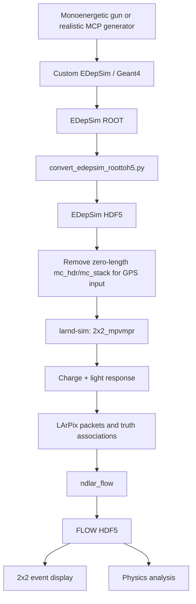

# DUNE ND-LAr 2×2 Millicharged-Particle Simulation

[](#current-status)
[](#nersc-environment)
[](#frozen-reference-baseline)
[](#license)

A reproducible simulation and validation workspace for **millicharged particles (MCPs)** in the DUNE ND-LAr **2×2 demonstrator**.

This repository brings together the complete chain

```text
MCP phase-space generation
        ↓
custom EDepSim / Geant4 transport and ionization
        ↓
EDepSim ROOT → larnd-sim HDF5 conversion
        ↓
larnd-sim charge + light detector response
        ↓
LArPix packet simulation
        ↓
ndlar_flow reconstruction
        ↓
2×2 event display and physics analysis
```

and pins the exact software revisions used for the first successful end-to-end MCP sample.

> [!IMPORTANT]
> The central feasibility milestone has been reached: a custom Geant4 MCP was generated, transported through the 2×2 geometry, converted into realistic charge and light response, encoded as LArPix packets, reconstructed with `ndlar_flow`, and opened successfully in the standard event display.
>
> The project has therefore moved beyond basic custom-particle debugging. The next phase is realistic generator development, production engineering, and physics validation.

> [!NOTE]
> The top-level GitHub repository is [`BrunoGelli/2x2MCP-sim`](https://github.com/BrunoGelli/2x2MCP-sim). On NERSC it is intentionally checked out as:
>
> ```text
> /pscratch/sd/b/bgelli/2x2_mcp
> ```
>
> Several scripts assume the checkout directory is named `2x2_mcp`.

---

## Contents

1. [Current status](#current-status)
2. [Scientific goal and scope](#scientific-goal-and-scope)
3. [Pipeline architecture](#pipeline-architecture)
4. [Repository organization](#repository-organization)
5. [Pinned software stack](#pinned-software-stack)
6. [What is and is not fully frozen](#what-is-and-is-not-fully-frozen)
7. [Quick start](#quick-start)
8. [NERSC environment](#nersc-environment)
9. [Custom MCP implementation in EDepSim](#custom-mcp-implementation-in-edepsim)
10. [Build the custom EDepSim](#build-the-custom-edepsim)
11. [Run controlled particle-gun samples](#run-controlled-particle-gun-samples)
12. [Physics validation completed so far](#physics-validation-completed-so-far)
13. [ROOT to HDF5 conversion](#root-to-hdf5-conversion)
14. [The `mc_hdr` / `mc_stack` compatibility issue](#the-mc_hdr--mc_stack-compatibility-issue)
15. [larnd-sim container setup](#larnd-sim-container-setup)
16. [larnd-sim configuration and execution](#larnd-sim-configuration-and-execution)
17. [ndlar_flow reconstruction](#ndlar_flow-reconstruction)
18. [Event display](#event-display)
19. [Frozen reference baseline](#frozen-reference-baseline)
20. [Regression strategy](#regression-strategy)
21. [Troubleshooting history](#troubleshooting-history)
22. [Git and submodule workflow](#git-and-submodule-workflow)
23. [Generator roadmap](#generator-roadmap)
24. [Production roadmap](#production-roadmap)
25. [Efficiency and analysis bookkeeping](#efficiency-and-analysis-bookkeeping)
26. [Creating a new baseline](#creating-a-new-baseline)
27. [Known limitations and open technical issues](#known-limitations-and-open-technical-issues)
28. [Related repositories and analysis context](#related-repositories-and-analysis-context)
29. [Contributing](#contributing)
30. [License](#license)
31. [Maintainer](#maintainer)

---

## Current status

| Component | Status | Notes |
|---|---:|---|
| Custom MCP particle in Geant4 | ✅ | Runtime-configurable mass and charge |
| MCP ionization transport in EDepSim | ✅ | `G4hIonisation` + `G4hMultipleScattering` |
| Muon-equivalence validation at `q = 1 e` | ✅ | MCP and muon energy loss agree |
| Charge-scaling validation | ✅ | Energy loss follows the expected approximately `q²` behavior |
| 2×2 geometry transport | ✅ | Controlled monoenergetic gun validated |
| EDepSim ROOT output | ✅ | Truth and deposited-energy content inspected |
| ROOT → HDF5 conversion | ✅ | Numerically agrees with ROOT energy deposition |
| GPS/non-GENIE truth compatibility | ⚠️ | Requires zero-length `mc_hdr` / `mc_stack` cleanup |
| Modern larnd-sim on Perlmutter GPU | ✅ | Podman-HPC + CUDA/Python hotfixes |
| Module-dependent 2×2 response | ✅ | Uses `2x2_mpvmpr` for independent particle-gun events |
| Charge and light response | ✅ | Full larnd-sim processing completed |
| LArPix packet output | ✅ | Produced successfully |
| `ndlar_flow` reconstruction | ✅ | Full Flow chain completed |
| Event display | ✅ | Final Flow file opened successfully |
| Frozen 100-event reference | ✅ | Files, hashes, software revisions, and notes preserved |
| Automated container launch/setup | ✅ | `scripts/launch_larnd_container.sh` |
| Fully pinned geometry + converter | ⚠️ | Still external to this top-level repository |
| Realistic beam-oriented MCP gun | 🚧 | Next generator milestone |
| Pythia-derived MCP phase space | 🚧 | Planned |
| Large-scale shard production | 🚧 | Planned |
| Neutrino/rock overlay | ⏳ | Deliberately deferred |

---

## Scientific goal and scope

The physics goal is to model relativistic millicharged particles traversing the DUNE ND-LAr 2×2 demonstrator with enough fidelity to evaluate:

- geometric acceptance;
- active-LAr energy deposition;
- charge and light detectability;
- LArPix packet formation;
- reconstruction efficiency;
- low-energy cluster topology;
- alignment with the expected source-to-detector direction;
- final signal-selection efficiency.

Relativistic MCPs are expected to produce sparse, soft ionization deposits with relatively little deflection. The detector-level signature is therefore not just a total deposited-energy problem. The simulation must preserve the relationship between:

```text
generator kinematics
→ Geant4 steps
→ active-volume segments
→ drifting electrons and optical photons
→ thresholded pixels and packets
→ reconstructed hits/clusters
→ final event-level observables
```

This repository focuses on the **simulation and detector-response chain**. The broader analysis includes data-driven background studies, off-beam control samples, angular sidebands, and a blinded small-angle signal region, but those analysis products are maintained separately.

### Deliberate scope boundary

The current baseline is an **MCP-only controlled validation sample**. It is not yet a realistic NuMI production sample and it does not yet overlay MCPs into neutrino-plus-rock spills.

The development order is intentional:

1. validate the custom particle and its energy loss;
2. validate the full detector response for simple, interpretable input;
3. freeze a known-good end-to-end sample;
4. improve the generator;
5. benchmark production and reconstruction efficiency;
6. only then introduce realistic event overlays.

---

## Pipeline architecture



Each stage should remain independently resumable. Production should never be organized as one monolithic job that must restart from the beginning after a late-stage failure.

The intended production architecture is:

```text
EDepSim CPU array
        ↓
conversion CPU array
        ↓
larnd-sim GPU array
        ↓
ndlar_flow CPU array
        ↓
analysis
```

---

## Repository organization

```text
2x2_mcp/
├── README.md
├── .gitignore
├── .gitmodules
│
├── configs/
│   └── ndlar_flow/
│       └── data/
│           ├── ndlar_flow/
│           │   ├── ndlar-module.yaml
│           │   └── runlist-2x2-mcexample.txt
│           └── proto_nd_flow/
│               ├── 2x2.yaml
│               ├── multi_tile_layout-2.4.16_v4.yaml
│               └── multi_tile_layout-2.5.16_v4.yaml
│
├── freeze/
│   └── 2026-08-17_working_baseline/
│       ├── README.md
│       ├── manifests/
│       │   ├── SHA256SUMS
│       │   ├── project_tree.txt
│       │   ├── software_state.txt
│       │   └── larnd_container_pip_freeze.txt
│       ├── notes/
│       │   ├── larnd_podman_setup.txt
│       │   └── mc_hdr_mc_stack.txt
│       ├── patches/
│       │   └── ndlar_flow_local_changes.patch
│       └── reference/                  # ignored by Git; retained on NERSC
│
├── gun_tests/
│   ├── analyze_gun.py
│   ├── mcp_gun.mac
│   ├── muon_gun.mac
│   └── charge_scan/
│       └── mcp_charge_scan.csv
│
├── scripts/
│   ├── launch_larnd_container.sh
│   └── setup_larnd_container.sh
│
├── software/
│   ├── edep-sim/                       # Git submodule
│   ├── edep-sim_build/                 # ignored local build tree
│   ├── edep-sim_install/               # ignored local install tree
│   ├── larnd-sim-current/              # Git submodule
│   └── flow/
│       ├── flow.venv/                  # ignored local environment
│       ├── h5flow/                     # Git submodule
│       └── ndlar_flow/                 # Git submodule
│
├── log/                                # ignored
└── out/                                # ignored
```

### What belongs in Git

Track:

- scripts;
- macros;
- small configuration files;
- small tabular validation summaries;
- exact submodule pointers;
- freeze manifests and notes;
- patches that explain local deviations;
- documentation.

Do not track:

- ROOT files;
- HDF5 simulation outputs;
- virtual environments;
- build/install trees;
- logs;
- generated plots;
- notebook checkpoints;
- large frozen reference data.

The top-level `.gitignore` enforces this separation.

---

## Pinned software stack

The parent repository uses Git submodules so that the full project records exact software commits without copying third-party repositories into its own history.

| Component | Repository | Branch hint | Frozen commit |
|---|---|---|---|
| Custom EDepSim | [`BrunoGelli/edep-sim`](https://github.com/BrunoGelli/edep-sim) | `feature/mcp-physics` | `e489bba20fd83f820d6e446c26af05c0d372d077` |
| larnd-sim | [`DUNE/larnd-sim`](https://github.com/DUNE/larnd-sim) | `develop` | `3b6449466e1e8036413ad9c6750b04a68515aea3` |
| h5flow | [`larpix/h5flow`](https://github.com/larpix/h5flow) | `main` | `1aaa36a0668f2a64f15703778c5c65168a24294f` |
| ndlar_flow | [`larpix/ndlar_flow`](https://github.com/larpix/ndlar_flow) | `develop` | `4705e95d20c3582e6421feb55a17a21c3bb1c24e` |

A separate runtime dependency is pinned by the container setup script:

| Package | Repository | Frozen commit |
|---|---|---|
| larpix-control | [`larpix/larpix-control`](https://github.com/larpix/larpix-control) | `5a69050422e82356c8faf9ad0ea3168c322d63e8` |

### Branch hint versus exact state

The `branch = ...` entries in `.gitmodules` are useful when intentionally asking Git to follow a branch with:

```bash
git submodule update --remote
```

They do **not** define the normal checkout state.

The parent repository records an exact Git object for every submodule. A normal:

```bash
git submodule update --init --recursive
```

restores those exact commits, often in detached-HEAD state. That detached state is expected and is one of the mechanisms that makes a parent commit reproducible.

### Expected baseline submodule output

```bash
git submodule status
```

should include:

```text
 e489bba20fd83f820d6e446c26af05c0d372d077 software/edep-sim
 1aaa36a0668f2a64f15703778c5c65168a24294f software/flow/h5flow
 4705e95d20c3582e6421feb55a17a21c3bb1c24e software/flow/ndlar_flow
 3b6449466e1e8036413ad9c6750b04a68515aea3 software/larnd-sim-current
```

The descriptive text in parentheses may vary. The SHA and path are the authoritative parts.

---

## What is and is not fully frozen

This repository deliberately distinguishes between **fully pinned**, **documented but external**, and **not yet captured** dependencies.

| Item | Coverage | Comment |
|---|---:|---|
| Custom MCP source | Exact | Pinned EDepSim submodule commit |
| larnd-sim source | Exact | Pinned submodule commit |
| h5flow / ndlar_flow source | Exact | Pinned submodule commits |
| larpix-control hotfix | Exact | Pinned Git commit in setup script |
| MCP/muon macros | Exact | Stored in `gun_tests/` |
| Flow overlay files | Exact | Stored under `configs/ndlar_flow/` |
| Baseline output integrity | Exact | SHA-256 manifest |
| Container launch command | Exact | Stored in `scripts/launch_larnd_container.sh` |
| Container setup procedure | Versioned | Stored in `scripts/setup_larnd_container.sh` |
| Resolved Python environment | Captured after successful setup | `larnd_container_pip_freeze.txt` |
| Podman image tag | Documented | `docker.io/mjkramer/sim2x2:ndlar011` |
| Podman image digest | **Not captured** | Image inspection failed on a login node where the image was not locally registered |
| 2×2 GDML geometry | External | Read from a separate `2x2_sim` checkout |
| ROOT → HDF5 converter | External | Read from a separate `2x2_sim` checkout |
| Exact `2x2_sim` commit | **Not frozen here** | Must be recorded before claiming a fully standalone rebuild |
| Geometry checksum | **Not frozen here** | Add to the next baseline |
| yaml-cpp source revision | **Not frozen here** | Historical build used a local checkout/build |
| Exact top-level Flow shell invocation | **Not frozen here** | Config/runlist and output are preserved; the successful command should be wrapped next time |
| Exact event-display invocation | **Not frozen here** | Compatibility was demonstrated, but the launch command was not promoted into this repo |

> [!WARNING]
> A recursive clone of this repository reproduces the four pinned submodules, but it does **not yet provide every external input required to rebuild the baseline from zero**. In particular, the geometry and converter were taken from a separate `2x2_sim` working tree.
>
> This does not invalidate the frozen result. It defines the remaining work needed for a strict fresh-account regression test.

---

## Quick start

### 1. Clone with submodules

The local directory name matters because the current NERSC launcher assumes `$SCRATCH/2x2_mcp`.

```bash
cd "$SCRATCH"

git clone --recurse-submodules \
    https://github.com/BrunoGelli/2x2MCP-sim.git \
    2x2_mcp

cd "$SCRATCH/2x2_mcp"
```

For an existing non-recursive clone:

```bash
git submodule sync --recursive
git submodule update --init --recursive
```

### 2. Inspect the frozen software state

```bash
git status
git log -1 --oneline
git submodule status
cat freeze/2026-08-17_working_baseline/manifests/software_state.txt
```

### 3. Check the controlled macros and configuration overlays

```bash
find gun_tests -maxdepth 2 -type f -print
find configs/ndlar_flow -type f -print
```

### 4. Launch the configured larnd-sim container

From a Perlmutter GPU allocation:

```bash
cd "$SCRATCH/2x2_mcp"
./scripts/launch_larnd_container.sh
```

The launcher:

1. starts `docker.io/mjkramer/sim2x2:ndlar011` with Podman-HPC;
2. exposes the GPU and CVMFS;
3. passes `$SCRATCH` into the container;
4. mounts the NERSC CUDA tree;
5. sources `scripts/setup_larnd_container.sh`;
6. installs the required Python/CUDA hotfixes;
7. verifies the pinned larnd-sim commit;
8. installs larnd-sim from the persistent submodule;
9. records the Python environment;
10. opens an interactive shell.

### 5. Verify the frozen output hashes, when the reference directory is available

The reference data are intentionally not stored in Git.

```bash
cd "$SCRATCH/2x2_mcp/freeze/2026-08-17_working_baseline/reference"
sha256sum -c ../manifests/SHA256SUMS
```

---

## NERSC environment

The known-good work was performed on **NERSC Perlmutter**.

### Persistent project location

```text
/pscratch/sd/b/bgelli/2x2_mcp
```

Equivalent environment-based path:

```bash
export MCP2X2_ROOT="$SCRATCH/2x2_mcp"
```

### GPU allocation

An interactive allocation may be obtained with a command similar to:

```bash
salloc -A dune -q interactive -C gpu -t 00:30:00
```

Account, QoS, and allocation syntax are site- and user-dependent. Use the current NERSC allocation associated with the work.

### Baseline software environment

The initial simulation image contained approximately:

- Geant4 `10.7.4`;
- ROOT `6.28/06`;
- CMake `3.27.7`;
- GCC `12.3.1`.

The host Git version recorded during the freeze was:

```text
git version 2.51.0
```

### Storage note

The large baseline files are under scratch storage. Scratch is not a substitute for a long-term archive. Before relying on this sample as a multi-year reference, copy the reference directory and its checksum manifest to an appropriate durable NERSC or collaboration-managed storage location.

---

## Custom MCP implementation in EDepSim

The custom particle is implemented in the pinned EDepSim fork under:

```text
software/edep-sim/src/lists/MCPPhysics.cc
software/edep-sim/src/lists/MCPPhysics.hh
```

and registered by:

```text
software/edep-sim/src/EDepSimPhysicsList.cc
```

### Particle definition

| Property | Value |
|---|---|
| Geant4 name | `mcp` |
| Default mass | `105.6583745 MeV` |
| Default charge | `+0.3 e` |
| PDG encoding | `9000001` |
| Spin | `1/2` |
| Width | `0` |
| Stability | stable |
| Particle type | `lepton` |
| Lepton number | `1` |
| Baryon number | `0` |
| Subtype | `mcp` |

### Runtime configuration

The particle definition reads two environment variables during Geant4 particle construction:

```bash
export EDEPSIM_MCP_MASS_MEV=105.6583745
export EDEPSIM_MCP_CHARGE=0.3
```

If either variable is absent, the validated default is used.

The values must be set **before launching `edep-sim`**.

The parser rejects:

- malformed strings;
- trailing nonnumeric text;
- overflow;
- non-finite values;
- `mass <= 10 MeV`;
- zero charge.

The mass restriction is tied to the current use of `G4hIonisation` in Geant4 10.7.4.

### Processes attached to the MCP

The current MCP receives:

```text
G4hMultipleScattering
G4hIonisation
```

with Geant4 process ordering:

```cpp
processManager->AddProcess(new G4hMultipleScattering(), -1, 1, 1);
processManager->AddProcess(new G4hIonisation(),         -1, 2, 2);
```

No explicit MCP-specific implementation of the following has yet been added:

- bremsstrahlung;
- pair production;
- separate single-Coulomb scattering;
- a dedicated low-mass ionization model.

For the current relativistic, ionization-focused validation, the implemented model was sufficient to test the full detector chain.

### Physics-list integration

The EDepSim physics list:

1. chooses a base Geant4 reference list, normally `QGSP_BERT`;
2. registers EDepSim `ExtraPhysics`;
3. registers optical physics;
4. registers `MCPPhysics`.

The base physics list can still be selected with EDepSim's `-p` option or the `PHYSLIST` environment variable.

### Important sign caveat

`EDEPSIM_MCP_CHARGE` can technically be negative because the implementation only rejects zero. However, changing the sign does **not** create a separate antiparticle definition or change the fixed PDG encoding `9000001`.

A study that needs distinct MCP/anti-MCP truth identities should extend the implementation rather than treating a negative environment-variable value as a complete antiparticle model.

---

## Build the custom EDepSim

### Historical known-good source/build/install layout

```text
$SCRATCH/2x2_mcp/software/edep-sim
$SCRATCH/2x2_mcp/software/edep-sim_build
$SCRATCH/2x2_mcp/software/edep-sim_install
```

The build and install directories are intentionally ignored by the parent repository.

### Baseline build procedure

Inside the original simulation environment:

```bash
source /opt/environment

mkdir -p "$SCRATCH/2x2_mcp/software/edep-sim_build"

cd "$SCRATCH/2x2_mcp/software/edep-sim_build"

cmake \
  -DCMAKE_PREFIX_PATH="$SCRATCH/2x2_mcp/software/yaml-cpp/build" \
  -DCMAKE_INSTALL_PREFIX="$SCRATCH/2x2_mcp/software/edep-sim_install" \
  ../edep-sim

make -j8
make install
```

The resulting executable is expected at:

```text
$SCRATCH/2x2_mcp/software/edep-sim_install/bin/edep-sim
```

### Build verification

```bash
git -C "$SCRATCH/2x2_mcp/software/edep-sim" rev-parse HEAD

"$SCRATCH/2x2_mcp/software/edep-sim_install/bin/edep-sim" -h
```

The source commit should be:

```text
e489bba20fd83f820d6e446c26af05c0d372d077
```

### Remaining build reproducibility gap

The historical CMake command references:

```text
$SCRATCH/2x2_mcp/software/yaml-cpp/build
```

but `yaml-cpp` is not currently a pinned submodule. Before a strict clean-account regression is declared complete, either:

- add a pinned yaml-cpp submodule;
- rely on a documented module/container-provided yaml-cpp;
- or provide a build script that obtains a specific release and verifies it.

---

## Run controlled particle-gun samples

The controlled gun is intentionally simple. It is a validation instrument, not the final physics generator.

### MCP gun macro

The tracked macro is:

```text
gun_tests/mcp_gun.mac
```

The baseline settings include:

```text
/edep/phys/ionizationModel 0
/edep/hitSeparation volTPCActive -1 mm
/edep/update

/gps/particle mcp
/gps/pos/type Point
/gps/pos/centre 1.5 -0.2 0.3 m
/gps/direction -1 0 0
/gps/energy 600 MeV

/edep/db/set requireEventsWithHits true
```

`/gps/energy 600 MeV` is the **kinetic energy**.

The mass and charge are not configured in the macro. They come from:

```text
EDEPSIM_MCP_MASS_MEV
EDEPSIM_MCP_CHARGE
```

### Geometry used for the baseline

The baseline used the GDML file:

```text
$SCRATCH/2x2_sim/geometry/Merged2x2MINERvA_v4/
    Merged2x2MINERvA_v4_withRock.gdml
```

This geometry is external to the current parent repository.

### Canonical controlled 100-event command

```bash
export MCP2X2_ROOT="$SCRATCH/2x2_mcp"
export EDEPSIM_MCP_MASS_MEV=105.6583745
export EDEPSIM_MCP_CHARGE=0.3

GEOM="$SCRATCH/2x2_sim/geometry/Merged2x2MINERvA_v4/Merged2x2MINERvA_v4_withRock.gdml"

"$MCP2X2_ROOT/software/edep-sim_install/bin/edep-sim" \
  -C \
  -g "$GEOM" \
  -o "$MCP2X2_ROOT/gun_tests/mcp_600MeV_100events.root" \
  -e 100 \
  "$MCP2X2_ROOT/gun_tests/mcp_gun.mac"
```

Relevant EDepSim options are:

| Option | Meaning |
|---|---|
| `-C` | Toggle geometry validation |
| `-e N` | Append `/run/beamOn N` after macros |
| `-g FILE` | Load GDML geometry |
| `-o FILE` | Output ROOT file |
| `-p LIST` | Select base physics list |
| `-s` | Use a time-based random seed |
| `-u` | Force `/edep/update` before the first macro |

For reproducible production, do **not** rely on `-s`. Use an explicit deterministic seed strategy.

### Muon comparison macro

The repository also tracks:

```text
gun_tests/muon_gun.mac
```

This enables a controlled comparison between:

- an MCP with muon mass and `q = 1 e`;
- a standard muon with the same kinetic energy and trajectory.

### Analyze ROOT samples

```bash
python gun_tests/analyze_gun.py \
    gun_tests/mcp_600MeV_100events.root \
    gun_tests/muon_600MeV_100events.root
```

The validation version inside the EDepSim submodule also contains:

```text
validation/mcp/analyze_gun.py
validation/mcp/analyze_charge_scan.py
validation/mcp/display_mcp_event.py
```

---

## Physics validation completed so far

### 1. Unit-charge MCP versus muon

A unit-charge MCP with the muon mass was compared to a standard positive muon under identical conditions.

Representative mean energy loss:

```text
MCP, q = 1 e:   0.182497 MeV/mm
mu+:            0.182481 MeV/mm
```

Representative total active-TPC deposited energy:

```text
approximately 262.78 MeV
```

The agreement showed that the custom particle behaves like an ordinary charged lepton in the controlled limit where it should.

### 2. Charge-squared scaling

For a `q = 0.3 e` MCP:

```text
mean dE/dx ≈ 0.0164092 MeV/mm
```

Relative to the unit-charge sample:

```text
0.0164092 / 0.182497 ≈ 0.0899
```

which agrees with:

```text
(0.3)² = 0.09
```

A larger scan, extending down to approximately `q = 0.01 e`, confirmed the expected trend over a broad range.

### 3. Step-limiter threshold check

EDepSim `ExtraPhysics` contains a charge-based condition that applies a step limiter only when:

```text
abs(charge) > 0.1
```

Therefore:

```text
q = 0.11 e  → step limiter active
q = 0.10 e  → step limiter inactive
q = 0.09 e  → step limiter inactive
```

A scan around this threshold did not show a physical discontinuity in the deposited-energy behavior. The implementation detail remains worth recording because it could matter for future precision studies.

### 4. Ionization-model caveat

Another EDepSim path uses a charge magnitude near `0.1` as a proxy for particle category in Doke/Birks-related logic. That categorization is conceptually unsafe for MCPs because electric charge is not a reliable particle-type identifier.

The controlled baseline uses:

```text
/edep/phys/ionizationModel 0
```

so that branch was not active in the current tests.

### 5. Conditional versus unconditional observables

At low charge, an increasing fraction of generated particles produces no accepted active-volume deposition.

The charge-scan analysis therefore distinguishes:

- unconditional mean energy deposition over all generated events;
- conditional `dE/dx` for events with accepted deposition;
- hit/no-hit efficiency.

This distinction is essential. A clean `q²` trend among hit events does not by itself describe the total detection probability.

---

## ROOT to HDF5 conversion

The successful conversion used the helper:

```text
$SCRATCH/2x2_sim/run-convert2h5/convert_edepsim_roottoh5.py
```

from a separate `2x2_sim` checkout.

The script exposes a Fire-based entry point equivalent to:

```python
dump(
    input_file,
    output_file,
    is_cosmic_sim=False,
    keep_all_dets=False,
)
```

### Example conversion

```bash
export TWOBYTWO_SIM="$SCRATCH/2x2_sim"
export MCP2X2_ROOT="$SCRATCH/2x2_mcp"

python "$TWOBYTWO_SIM/run-convert2h5/convert_edepsim_roottoh5.py" \
    "$MCP2X2_ROOT/gun_tests/mcp_600MeV_100events.root" \
    "$MCP2X2_ROOT/gun_tests/mcp_600MeV_100events_03e.EDEPSIM.hdf5"
```

### Baseline converted content

The 100-event converted file contained approximately:

| Dataset/content | Count |
|---|---:|
| vertices | 100 |
| trajectories | 684 |
| segments | 1,566 |
| `mc_hdr` before cleanup | 0 |
| `mc_stack` before cleanup | 0 |

Trajectory population:

| Particle | Count |
|---|---:|
| MCP, PDG `9000001` | 100 |
| electrons | 503 |
| gammas | 81 |

Segment population:

| Particle | Count |
|---|---:|
| MCP | 678 |
| electrons | 807 |
| gammas | 81 |

The total deposited energy in the converted HDF5 file was approximately:

```text
2372.91 MeV
```

and matched the EDepSim ROOT result.

### Converter bookkeeping caveat

Events without a `volTPCActive` segment can disappear during conversion.

For low-charge production, always preserve separate counts for:

```text
generated events
events entering the detector
events with active-LAr deposition
events surviving conversion
```

Do not use the number of converted vertices as a substitute for the number of generated MCPs.

---

## The `mc_hdr` / `mc_stack` compatibility issue

### Symptom

For GPS/particle-gun input without GENIE truth, the converter creates:

```text
mc_hdr
mc_stack
```

but both datasets have zero rows.

Modern larnd-sim interprets dataset **existence** as evidence that generator truth is present. It then reaches an operation equivalent to:

```python
mc_hdr["t_event"] = vertices["t_event"]
```

which fails because:

```text
vertices: 100 rows
mc_hdr:     0 rows
```

### Baseline workaround

Keep the original converted file, make a larnd-sim input copy, and delete only generator-truth datasets that both exist and have zero length.

```bash
cp \
  gun_tests/mcp_600MeV_100events_03e.EDEPSIM.hdf5 \
  gun_tests/mcp_600MeV_100events_03e.LARNDINPUT.hdf5
```

```bash
python - <<'PY'
import h5py

filename = "gun_tests/mcp_600MeV_100events_03e.LARNDINPUT.hdf5"

with h5py.File(filename, "r+") as f:
    for name in ("mc_hdr", "mc_stack"):
        if name in f and len(f[name]) == 0:
            print(f"Deleting zero-length dataset: {name}")
            del f[name]
PY
```

### Safety rule

Never delete nonempty `mc_hdr` or `mc_stack` datasets from a sample with real generator truth.

### Long-term fix

The converter should not create these datasets for non-GENIE inputs, or larnd-sim should explicitly distinguish between:

- absent generator truth;
- present but empty generator truth;
- valid populated generator truth.

The current workaround is documented under:

```text
freeze/2026-08-17_working_baseline/notes/mc_hdr_mc_stack.txt
```

---

## larnd-sim container setup

### Why the original image was not enough

The base image:

```text
docker.io/mjkramer/sim2x2:ndlar011
```

contains a useful 2×2 software environment, but its bundled larnd-sim predates the modern named-configuration interface. In the old installation:

```python
import larndsim
```

worked, while modern imports such as:

```python
from larndsim.config import get_config
```

did not.

The solution was to keep the base image for its broader environment while installing the pinned modern larnd-sim submodule from `$SCRATCH`.

### Automated launch

From the project root on a GPU node:

```bash
./scripts/launch_larnd_container.sh
```

The launcher executes:

```bash
podman-hpc run \
    --rm \
    -it \
    --gpu \
    --cvmfs \
    --env SCRATCH="${SCRATCH}" \
    --env MCP2X2_ROOT="${SCRATCH}/2x2_mcp" \
    -v "${SCRATCH}:${SCRATCH}" \
    -v /dvs_ro/cfs:/dvs_ro/cfs \
    -v /opt/nvidia/hpc_sdk/Linux_x86_64/23.9:/opt/cuda \
    docker.io/mjkramer/sim2x2:ndlar011 \
    /bin/bash
```

and automatically sources:

```text
scripts/setup_larnd_container.sh
```

### What the setup script does

Inside the container it:

1. sources `/opt/environment`;
2. sets `CUDA_HOME=/opt/cuda/cuda/12.2`;
3. adds the CUDA runtime and math-library paths;
4. installs `numba-cuda[cu12]`;
5. finds and prepends the directory containing `libnvJitLink.so.12`;
6. installs pinned `larpix-control`;
7. verifies the exact larnd-sim Git commit;
8. installs larnd-sim in editable mode with `SKIP_CUPY_INSTALL=1`;
9. writes a baseline `pip freeze` or a timestamped runtime manifest;
10. returns to the project root.

### Manual equivalent

```bash
source /opt/environment

export CUDA_HOME=/opt/cuda/cuda/12.2
export PATH="$CUDA_HOME/bin:$PATH"

export LD_LIBRARY_PATH="/opt/cuda/math_libs/12.2/targets/x86_64-linux/lib:$CUDA_HOME/lib64:${LD_LIBRARY_PATH:-}"

python -m pip install 'numba-cuda[cu12]'

python -m pip install --force-reinstall \
  'git+https://github.com/larpix/larpix-control.git@5a69050422e82356c8faf9ad0ea3168c322d63e8'

cd "$SCRATCH/2x2_mcp/software/larnd-sim-current"

SKIP_CUPY_INSTALL=1 python -m pip install -e .

NVJITLINK_DIR="$(
    find /opt/venv \
      -type f \
      -name 'libnvJitLink.so.12' \
      -printf '%h\n' \
      -quit 2>/dev/null
)"

export LD_LIBRARY_PATH="${NVJITLINK_DIR}:${LD_LIBRARY_PATH}"
```

### Sanity checks inside the container

```bash
git -C "$MCP2X2_ROOT/software/larnd-sim-current" rev-parse HEAD

python - <<'PY'
import cupy as cp
import larndsim
from numba import cuda

print("larnd-sim:", larndsim.__file__)
print("CuPy:", cp.__version__)
print("CUDA devices:", cp.cuda.runtime.getDeviceCount())
print("Numba CUDA available:", cuda.is_available())

if cp.cuda.runtime.getDeviceCount():
    props = cp.cuda.runtime.getDeviceProperties(0)
    name = props["name"]
    if isinstance(name, bytes):
        name = name.decode()
    print("GPU:", name)
PY

python -m pip check
```

The validated environment saw:

```text
GPU: NVIDIA A100-SXM4-40GB
CuPy: 12.2.0
CUDA runtime: 12020
CUDA driver: 13000
CUDA devices: 1
```

### Ephemeral versus persistent state

The launcher uses:

```text
--rm
```

Therefore changes under the container's `/opt/venv` disappear on exit.

Persistent:

- source repositories under `$SCRATCH`;
- generated data under `$SCRATCH`;
- Flow virtual environment under `$SCRATCH`;
- freeze manifests;
- logs.

Ephemeral and recreated at launch:

- `numba-cuda`;
- pinned `larpix-control`;
- editable larnd-sim installation;
- dynamic-library path ordering.

### Current reproducibility limitations of the setup script

The setup is automated, but it is not yet a fully immutable software image:

- the base image is pinned by tag, not digest;
- `numba-cuda[cu12]` is not pinned to an exact version in the script;
- transitive Python dependencies are not locked before installation;
- strict replay therefore depends on the recorded `pip freeze`.

For long-lived production, the preferred endpoint is either:

1. a version-locked requirements file generated from the successful environment; or
2. a derived container image with a recorded digest.

### Fresh-clone submodule check

A Git submodule's `.git` entry can be a **file**, not a directory. A robust setup script should test the checkout with Git itself:

```bash
if ! git -C "${LARND_DIR}" rev-parse --is-inside-work-tree >/dev/null 2>&1; then
    echo "ERROR: larnd-sim checkout not found or invalid: ${LARND_DIR}"
    return 1
fi
```

This is more portable than requiring:

```bash
[[ -d "${LARND_DIR}/.git" ]]
```

Apply this hardening before using the current setup script as a fresh-clone regression test on a new account.

---

## larnd-sim configuration and execution

### Why `2x2_mpvmpr`

The modern `2x2` configuration uses beam/spill timing, including:

```text
is_spill_sim = 1
spill_period ≈ 1.2e6 μs
```

That is appropriate for beam-spill simulation but not ideal for independent particle-gun events.

The controlled baseline uses:

```text
--config 2x2_mpvmpr
```

This retains the detailed module-dependent 2×2 detector response while using a non-spill independent-event configuration.

### Module-dependent detector response

The modern configuration includes:

```text
PIXEL_LAYOUT_ID = [0, 0, 1, 0]
RESPONSE_ID     = [0, 0, 1, 0]
LIGHT_LUT_ID    = [0, 1, 1, 1]
```

It also includes:

- module-specific pixel layouts;
- v2a-like versus v2b-like charge-response files;
- separate threshold maps;
- separate pedestal maps;
- module-to-module variation;
- module-specific light LUT selection;
- optical noise inputs.

This was an important improvement over the old single/manual configuration path.

### Baseline run command

Inside the configured Podman container:

```bash
export MCP2X2_ROOT="${MCP2X2_ROOT:-$SCRATCH/2x2_mcp}"

LARNDIN="$MCP2X2_ROOT/gun_tests/mcp_600MeV_100events_03e.LARNDINPUT.hdf5"
LARNDOUT="$MCP2X2_ROOT/gun_tests/mcp_600MeV_100events_03e.LARNDSIM.hdf5"

simulate_pixels.py \
    --config 2x2_mpvmpr \
    --input_filename "$LARNDIN" \
    --output_filename "$LARNDOUT" \
    --rand_seed 12345
```

The seed should be recorded in any new baseline or production manifest.

### Baseline behavior

The 100-event job visibly completed stages including:

```text
Quenching electrons
Drifting electrons
Calculating optical responses
Simulating batches
```

Representative runtime:

```text
177.98 s
```

The output file was approximately:

```text
414 MB
```

larnd-sim rejected exactly:

```text
81 neutral track segments
```

which matched the 81 gamma segments present in the converted input. This is a useful consistency check.

### Nonfatal warning

The baseline emitted:

```text
More ADC values than possible, 30
```

during module processing.

The run completed successfully. The warning should nevertheless be investigated before large production to determine whether it has any effect on ADC bookkeeping or truth associations.

---

## ndlar_flow reconstruction

### Pinned reconstruction software

```text
software/flow/h5flow
software/flow/ndlar_flow
```

are independent pinned submodules.

### Why project-specific Flow files live outside the submodule

The working `ndlar_flow` checkout initially contained local modifications and new files:

```text
data/ndlar_flow/ndlar-module.yaml
data/ndlar_flow/runlist-2x2-mcexample.txt
data/proto_nd_flow/2x2.yaml
data/proto_nd_flow/multi_tile_layout-2.4.16_v4.yaml
data/proto_nd_flow/multi_tile_layout-2.5.16_v4.yaml
```

To keep the upstream submodule clean and reproducible:

1. the local diff was saved under the freeze directory;
2. the working configuration files were copied to `configs/ndlar_flow/`;
3. the submodule was reset to its upstream commit;
4. the clean exact commit was registered in the parent repository.

The separation is intentional:

```text
software/flow/ndlar_flow/
    upstream reconstruction code

configs/ndlar_flow/
    MCP-project-specific 2×2 overlays and runlist
```

### Preserved provenance

```text
freeze/2026-08-17_working_baseline/
├── manifests/ndlar_flow_local_status.txt
└── patches/ndlar_flow_local_changes.patch
```

### Reconstruction stages demonstrated

The successful Flow chain included the normal sequence of MC workflows, including charge-side stages such as:

```text
charge_event_building_mc
charge_event_reconstruction_mc
combined_reconstruction_mc
prompt_calibration_mc
final_calibration_mc
```

light-side stages such as:

```text
light_event_building_mc
light_event_reconstruction_mc
```

and final charge-light association:

```text
charge_light_assoc_mc
```

### Command provenance limitation

The exact successful one-line Flow invocation was not promoted into a top-level script before the freeze.

The configuration overlays, runlist, pinned software, final output, and patch are preserved, but a strict new-user reproduction should not guess the command from memory.

The next successful execution should immediately be wrapped as, for example:

```text
scripts/run_ndlar_flow.sh
```

with:

- explicit input and output arguments;
- explicit configuration paths;
- environment activation;
- exit-on-error behavior;
- logging;
- command echoing;
- software revision recording.

### Historical external wrapper

The separate `2x2_sim` project has historically used an interface of the form:

```bash
cd "$TWOBYTWO_SIM/run-ndlar-flow"

export ARCUBE_RUNTIME=NONE
export ARCUBE_IN_NAME="..."
export ARCUBE_OUT_NAME="..."
export ARCUBE_INDEX="..."

./run_ndlar_flow.sh
```

Treat that as historical context, not as a guaranteed current command for this top-level repository.

---

## Event display

The final:

```text
mcp_600MeV_100events_03e.FLOW.hdf5
```

file opened successfully in the existing 2×2 event display.

This demonstrated format and reconstruction compatibility through the final visualization layer.

The event display was considered sufficient as an end-to-end proof, but it was still preliminary. Some displayed activity appeared outside the intended detector volume. The visualization therefore should not yet be treated as a polished physics-selection tool.

A future top-level display wrapper should record:

- input file;
- event number;
- geometry/configuration;
- volume cuts;
- view parameters;
- output image path.

---

## Frozen reference baseline

The first known-good end-to-end sample was frozen on **2026-08-17**.

### Physics parameters

| Parameter | Value |
|---|---:|
| Particle | `mcp` |
| PDG | `9000001` |
| Mass | `105.6583745 MeV` |
| Charge | `+0.3 e` |
| Kinetic energy | `600 MeV` |
| Total energy | approximately `705.658374 MeV` |
| Initial momentum | approximately `697.703411 MeV/c` |
| Generated events | `100` |
| Gun position | `(1.5, -0.2, 0.3) m` |
| Gun direction | `(-1, 0, 0)` |
| larnd-sim config | `2x2_mpvmpr` |
| larnd-sim seed | `12345` in the documented command |

### Frozen artifacts

| Stage | File | Approximate size | SHA-256 |
|---|---|---:|---|
| EDepSim ROOT | `mcp_600MeV_100events.root` | `7.3 MB` | `1677906071b082fdd80ca575c656dbe4d6e7e6bbd626a3499fd698167c767fb9` |
| Converted HDF5 | `mcp_600MeV_100events_03e.EDEPSIM.hdf5` | `349 KB` | `669bb51eb312ef4791a6050c0700ff7a6ade37445015f69feea9e388a91fd05a` |
| Clean larnd input | `mcp_600MeV_100events_03e.LARNDINPUT.hdf5` | `349 KB` | `d5202c08efeecabf3df6c02d1a751e05fc59404aa4e4eb50810a9b96c48e9957` |
| larnd-sim output | `mcp_600MeV_100events_03e.LARNDSIM.hdf5` | `414 MB` | `83d980e5a9579a331161af20b70e25864ee68e8fc552e8a4d453d0929ade031b` |
| Flow output | `mcp_600MeV_100events_03e.FLOW.hdf5` | `5.2 MB` | `e723b8acc5dc0cccf4d2e55019fd3580996a8579ba3fce07c572cfd0c2525f6a` |

### Reference location

```text
freeze/2026-08-17_working_baseline/reference/
```

This directory is intentionally ignored by Git.

### Verify integrity

```bash
cd freeze/2026-08-17_working_baseline/reference
sha256sum -c ../manifests/SHA256SUMS
```

Expected result:

```text
mcp_600MeV_100events_03e.EDEPSIM.hdf5: OK
mcp_600MeV_100events_03e.FLOW.hdf5: OK
mcp_600MeV_100events_03e.LARNDINPUT.hdf5: OK
mcp_600MeV_100events_03e.LARNDSIM.hdf5: OK
mcp_600MeV_100events.root: OK
```

### Baseline tag

The freeze procedure uses the top-level tag:

```text
baseline-100evt-03e
```

Verify local and remote tag state with:

```bash
git tag --list
git ls-remote --tags origin
```

To inspect the exact project state represented by the tag:

```bash
git checkout baseline-100evt-03e
git submodule update --init --recursive
```

Return to development with:

```bash
git switch main
git submodule update --init --recursive
```

---

## Regression strategy

A file checksum and a physics regression answer different questions.

### Level 1 — Frozen-file integrity

Question:

> Has an archived reference file changed?

Test:

```bash
sha256sum -c SHA256SUMS
```

This is a byte-level integrity test.

### Level 2 — Structural regression

Question:

> Does a newly generated sample have the expected schemas and populations?

Check:

- required HDF5 datasets;
- event/vertex count;
- MCP PDG population;
- segment count;
- trajectory count;
- packet count;
- module coverage;
- Flow dataset presence;
- truth-association presence.

### Level 3 — Physics regression

Question:

> Does the detector simulation remain physically consistent after a software or model change?

Check distributions and summaries such as:

- MCP path length;
- total active-volume energy deposition;
- conditional and unconditional `dE/dx`;
- fraction of zero-deposit events;
- `q²` scaling;
- charge packets per event;
- threshold-crossing probability;
- light yield;
- reconstructed hit/cluster multiplicity;
- angular residuals;
- reconstruction efficiency.

### Level 4 — End-to-end usability

Question:

> Can a standard user process and inspect the result?

Test:

- fresh clone;
- submodule initialization;
- container setup;
- one small GPU job;
- Flow completion;
- event-display open;
- clear logs and failure messages.

### Why exact rerun SHA equality may be too strict

Even with a fixed random seed, GPU kernels, dependency revisions, floating-point reduction order, HDF5 metadata, and compression details can make a scientifically equivalent rerun differ byte-for-byte.

Therefore:

- use SHA-256 to protect the archived reference;
- use structural and physics tolerances to validate a regenerated sample;
- only demand new-output SHA equality after explicitly proving deterministic byte-level behavior on the same stack.

---

## Troubleshooting history

The following failures were important because they explain the current architecture.

| Symptom | Root cause | Resolution |
|---|---|---|
| `larndsim.config` missing | Base image contained old larnd-sim | Overlay pinned modern larnd-sim from `$SCRATCH` |
| GPU visible in Shifter but `libcudart.so.12` missing | CUDA runtime not correctly exposed inside image | Switched to Podman-HPC with explicit host CUDA mount |
| Shifter volume mount failed before startup | Direct `/opt/nvidia/...` mount not supported in that path | Abandoned this Shifter route |
| `$SCRATCH` empty inside container | Mounting a path does not export the environment variable | Added `--env SCRATCH="$SCRATCH"` |
| larnd-sim first cloned under `/2x2_mcp` | Missing `$SCRATCH` in container | Moved source to persistent `$SCRATCH/2x2_mcp` |
| `numba.cuda.core` / modern CUDA API mismatch | Old Numba/CUDA integration in image | Installed `numba-cuda[cu12]` |
| Missing `Packet_v3` or incompatible packet API | Old larpix-control in image | Installed pinned modern larpix-control commit |
| nvJitLink symbol/version error | Wrong `libnvJitLink.so.12` found first | Prepended pip-installed nvJitLink directory |
| `mc_hdr` shape mismatch | Converter created empty generator-truth datasets | Delete only zero-length `mc_hdr` / `mc_stack` in a copy |
| Beam-spill timing inappropriate for gun | Standard `2x2` config assumes spills | Use `2x2_mpvmpr` |
| `81 neutral track segments` rejected | Gamma segments are neutral | Expected and matched converted truth population |
| `More ADC values than possible, 30` | Not yet fully diagnosed | Nonfatal; record and investigate |
| Flow submodule appeared dirty | Project-specific overlays lived inside upstream checkout | Copy overlays to parent, save patch, clean/pin submodule |
| Generated PNG/checkpoint clutter staged | Ignore rules were incomplete | Ignore `*.png` and `.ipynb_checkpoints/` |
| Parent accidentally treated `software/flow` as a repo | It was only a container directory | Register `h5flow` and `ndlar_flow` individually |
| `podman-hpc image inspect` failed | Image not known in that login-node local store | Preserve tag/setup/pip manifest; capture digest later |
| Event display showed out-of-volume content | Display selection still preliminary | Treat display as compatibility proof, refine volume filtering |

### Debugging the container

```bash
echo "$SCRATCH"
echo "$MCP2X2_ROOT"
nvidia-smi

which python
python --version
python -m pip --version
python -m pip freeze | grep -E 'numba|cupy|larpix|larnd'

python - <<'PY'
import larndsim
print(larndsim.__file__)
PY

find /opt/venv -name 'libnvJitLink.so.12' -print
echo "$LD_LIBRARY_PATH"
```

The imported larnd-sim path should point under:

```text
$SCRATCH/2x2_mcp/software/larnd-sim-current/larndsim
```

not a stale `/opt/generators/...` installation.

---

## Git and submodule workflow

### Clone a frozen parent commit

```bash
git clone --recurse-submodules \
    https://github.com/BrunoGelli/2x2MCP-sim.git \
    2x2_mcp

cd 2x2_mcp
git submodule status
```

### Update ordinary parent files

```bash
git switch main
git pull --ff-only
git submodule update --init --recursive
```

### Develop inside a submodule

Example for the custom EDepSim fork:

```bash
cd software/edep-sim

git switch feature/mcp-physics
git pull --ff-only origin feature/mcp-physics

# edit and test

git add <files>
git commit -m "Describe the MCP physics change"
git push origin feature/mcp-physics
```

Return to the parent and record the new submodule pointer:

```bash
cd ../..

git add software/edep-sim
git commit -m "Update EDepSim MCP physics revision"
git push origin main
```

### Never assume a parent commit stores uncommitted submodule work

The parent stores only the submodule commit SHA. It cannot preserve:

- untracked files inside a submodule;
- unstaged edits;
- staged-but-uncommitted edits.

Before a parent checkpoint:

```bash
git submodule foreach --recursive 'echo; echo "$name"; git status --short'
```

Every intentional submodule modification must either be:

1. committed and pushed in that submodule; or
2. copied into the parent project as a config/patch and removed from the submodule.

### Avoid accidental upgrades

Do not run this casually on the frozen baseline:

```bash
git submodule update --remote
```

It follows branch hints and can advance one or more submodules.

For exact restoration use:

```bash
git submodule update --init --recursive
```

### Verify that submodule commits are remotely reachable

Inside each modified submodule:

```bash
git fetch origin
git branch -r --contains HEAD
```

A parent repository that points to a commit available only on one NERSC filesystem is not reproducible.

---

## Generator roadmap

### Current validation generator

The current GPS macro emits one MCP per event:

```text
position:  (1.5, -0.2, 0.3) m
direction: (-1, 0, 0)
kinetic energy: 600 MeV
```

This was intentionally chosen to produce simple, interpretable detector crossings.

It is not the final NuMI production geometry.

### Stage 1 — Geometry-correct beam-like gun

Implement a controlled generator with:

- source position corresponding to the NuMI production target or an equivalent far-upstream source;
- direction pointing toward the 2×2 detector;
- correct coordinate transformation;
- configurable transverse offsets;
- deterministic seed;
- explicit event metadata.

This remains a monoenergetic validation mode but tests the correct beam-axis convention.

### Stage 2 — Realistic phase-space input

Use the existing Pythia-derived production study to provide event-by-event:

```text
x, y, z, t
px, py, pz
mass
charge
event weight
production channel
random seed / event identifier
```

A clean architecture is:

```text
Pythia / production calculation
        ↓
portable phase-space file
        ↓
lightweight MCP event generator
        ↓
EDepSim
```

This keeps production-model development separate from Geant4 detector transport.

### Preserve the simple gun permanently

The fixed monoenergetic gun should remain in the repository because it is useful for:

- unit tests;
- `q²` validation;
- software regressions;
- geometry debugging;
- response-map comparisons;
- threshold studies;
- performance benchmarks.

---

## Production roadmap

### Target scale

The long-term goal discussed for important model points is of order:

```text
10 million generated MCPs
```

per point, subject to actual acceptance and reconstruction efficiency.

The initial grid is approximately:

```text
3 charges × 2 masses
```

The final statistics should not be blindly identical. Lower-charge points may require more generated events to achieve comparable reconstructed yield.

### Pilot sequence

Before large production:

```text
10³ events
10⁴ events
10⁵ events
```

At every scale validate:

- generator distributions;
- EDepSim truth;
- conversion bookkeeping;
- active-LAr energy deposition;
- larnd-sim throughput;
- packet output;
- Flow reconstruction;
- truth associations;
- event display;
- final efficiency.

### EDepSim sharding

Do not run 10 million events in one process.

Benchmark candidate shard sizes:

```text
1,000 events
5,000 events
10,000 events
```

Measure:

- events/s;
- memory;
- output size;
- startup overhead;
- failure/retry granularity;
- conversion time.

EDepSim is naturally suited to many independent Slurm array jobs.

### Deterministic seeds

A production seed should be a deterministic function of:

```text
production ID
mass point
charge point
generator mode/version
shard ID
```

Store the actual seed, not just the rule.

### larnd-sim batching

The 100-event baseline took about 178 seconds, so 100 events per production GPU job is too small.

Benchmark:

```text
100
500
1,000
5,000
10,000
```

Measure:

- fixed startup/JIT/LUT cost;
- events/s;
- peak GPU memory;
- output size;
- failure behavior.

### Skip truly empty events carefully

It may be efficient to avoid larnd-sim for events with no active-LAr deposition, but the bookkeeping must preserve:

```text
N generated
N geometrically entering detector
N with active-LAr deposition
N passed to larnd-sim
N producing packets
N reconstructed
N passing final analysis
```

Otherwise the simulation will silently overestimate efficiency.

### Keep stages independent

Recommended dependency graph:

```text
EDepSim array
    ↓
convert2h5 array
    ↓
larnd-sim GPU array
    ↓
ndlar_flow array
    ↓
analysis
```

A Flow failure should require rerunning only Flow, not larnd-sim.

---

## Efficiency and analysis bookkeeping

At minimum, every model point should report:

| Stage | Symbol / meaning |
|---|---|
| Generated | all MCPs requested from the generator |
| Valid generator record | events with usable phase-space data |
| Geometric acceptance | trajectories intersecting the relevant detector region |
| Active-LAr deposition | at least one accepted active-volume segment |
| Conversion survival | event represented in converted HDF5 |
| Packet production | at least one detector packet |
| Flow reconstruction | event/hits represented in Flow output |
| Analysis preselection | passes basic quality and fiducial requirements |
| Final signal selection | passes the MCP analysis |

### Production manifest

A machine-readable manifest should contain fields such as:

```yaml
production_id:
model:
  mass_mev:
  charge_e:
generator:
  mode:
  version:
  source_commit:
  seed:
shard:
  id:
  n_requested:
software:
  parent_commit:
  edep_sim_commit:
  larnd_sim_commit:
  h5flow_commit:
  ndlar_flow_commit:
  larpix_control_commit:
configuration:
  geometry_path:
  geometry_sha256:
  converter_commit:
  larnd_config:
  flow_runlist:
stages:
  edep:
    status:
    file:
    checksum:
  convert:
    status:
    file:
    checksum:
  larnd:
    status:
    file:
    checksum:
  flow:
    status:
    file:
    checksum:
counts:
  generated:
  entering_detector:
  active_deposition:
  converted:
  packets:
  reconstructed:
timestamps:
  created:
  completed:
```

A simple CSV/JSON/YAML implementation is sufficient initially. A database is not required to begin organized production.

---

## Creating a new baseline

Create a new baseline only after a scientifically meaningful or infrastructure-relevant milestone.

### 1. Start from clean repositories

```bash
git status
git submodule foreach --recursive 'echo; echo "$name"; git status --short'
```

### 2. Record exact revisions

```bash
git rev-parse HEAD
git submodule status
```

Verify every custom submodule commit is pushed.

### 3. Record all external inputs

At minimum:

```bash
sha256sum geometry.gdml
git -C "$SCRATCH/2x2_sim" rev-parse HEAD
sha256sum convert_edepsim_roottoh5.py
```

This closes two gaps in the 2026-08-17 freeze.

### 4. Run the controlled sample

Use explicit:

- mass;
- charge;
- kinetic energy;
- position/direction;
- event count;
- EDepSim seed;
- larnd-sim seed;
- configuration names.

### 5. Preserve every stage

```text
ROOT
EDEPSIM.hdf5
LARNDINPUT.hdf5
LARNDSIM.hdf5
FLOW.hdf5
```

### 6. Validate content

Record:

- event/vertex count;
- particle populations;
- segment count;
- total deposited energy;
- packet count;
- Flow dataset inventory;
- runtime;
- warnings;
- display compatibility.

### 7. Copy reference files

```bash
mkdir -p "freeze/<date>_<name>/reference"
cp -av <files> "freeze/<date>_<name>/reference/"
```

### 8. Generate checksums

```bash
cd "freeze/<date>_<name>/reference"
sha256sum * > ../manifests/SHA256SUMS
sha256sum -c ../manifests/SHA256SUMS
```

### 9. Capture environment

Record:

- host;
- date;
- Git revisions;
- image tag and digest;
- `pip freeze`;
- CUDA runtime/driver;
- GPU model;
- command lines;
- random seeds.

### 10. Keep data out of Git

Track the manifests and notes, not hundreds of megabytes of output.

### 11. Commit and tag

```bash
git add README.md configs scripts freeze
git add software/edep-sim software/larnd-sim-current
git add software/flow/h5flow software/flow/ndlar_flow

git commit -m "Freeze <description> baseline"

git tag -a <baseline-tag> \
  -m "<complete baseline description>"

git push origin main
git push origin <baseline-tag>
```

### 12. Test from a clean directory

```bash
git clone --recurse-submodules \
  https://github.com/BrunoGelli/2x2MCP-sim.git \
  clean-test

cd clean-test
git checkout <baseline-tag>
git submodule update --init --recursive
```

A baseline is not fully reproducible until this clean-clone path has been exercised.

---

## Known limitations and open technical issues

### High priority

1. **Pin the external `2x2_sim` revision.**  
   The baseline geometry and converter are not submodules of this repository.

2. **Store a geometry checksum.**  
   A path alone does not prove that a GDML file is unchanged.

3. **Wrap conversion, Flow, and event display.**  
   Promote the successful commands into versioned top-level scripts.

4. **Harden the larnd setup script for fresh submodules.**  
   Test the repository with `git -C ... rev-parse`, not only `-d .git`.

5. **Lock the Python/CUDA environment.**  
   Pin `numba-cuda` and other resolved dependencies or build a derived image.

6. **Capture the Podman image digest.**  
   The current freeze records only the image tag.

7. **Fix the converter's GPS truth behavior.**  
   Do not create zero-length `mc_hdr` / `mc_stack` datasets for non-GENIE input.

8. **Preserve generated-event bookkeeping through conversion.**  
   Empty active-volume events must remain represented in efficiency accounting.

### Physics/modeling

9. The current ionization model requires `mass > 10 MeV`.

10. The step-limiter condition changes at `|q| = 0.1 e`.

11. Charge-based particle categorization elsewhere in EDepSim should be audited.

12. Negative charge does not create a distinct antiparticle truth definition.

13. Bremsstrahlung, pair production, and dedicated MCP scattering models are not implemented.

14. The current gun direction and origin are validation placeholders.

### Detector/reconstruction

15. Investigate:

```text
More ADC values than possible, 30
```

16. Validate truth associations at low charge and low packet multiplicity.

17. Quantify module-by-module threshold and response effects.

18. Promote Flow and display commands into the parent repository.

19. Refine event-display detector-volume filtering.

### Production

20. Benchmark practical EDepSim shard size.

21. Benchmark larnd-sim batch size and GPU memory.

22. Add stage-level retry/resume tooling.

23. Add a production manifest and status summarizer.

24. Define physics-level regression tolerances.

25. Archive the known-good reference outside scratch.

---

## Related repositories and analysis context

### Current orchestration repository

- [`BrunoGelli/2x2MCP-sim`](https://github.com/BrunoGelli/2x2MCP-sim)  
  This repository: pinned software stack, controlled guns, Flow overlays, container scripts, and frozen baselines.

### Custom EDepSim fork

- [`BrunoGelli/edep-sim`](https://github.com/BrunoGelli/edep-sim)  
  Contains the custom MCP Geant4 particle and validation tools.

### External 2×2 simulation workflow

- [`BrunoGelli/2x2_sim`](https://github.com/BrunoGelli/2x2_sim)  
  Historical source of the geometry, converter, and existing production wrappers used during the baseline.

### Earlier MCP/production studies

- [`BrunoGelli/MCPtestGeant4`](https://github.com/BrunoGelli/MCPtestGeant4)
- [`BrunoGelli/NewPhysicsAt2x2`](https://github.com/BrunoGelli/NewPhysicsAt2x2)  
  Earlier Pythia-related work was developed on branch `HongCaiMods`; a historically referenced commit is `bef0563`.

These repositories should not be silently mixed. Their role and exact revisions should be recorded whenever they contribute an input to a production.

---

## Contributing

Before proposing a change:

1. identify whether it belongs in the parent orchestration repo or a submodule;
2. keep generated data out of Git;
3. add a controlled validation when changing physics;
4. record exact seeds and configurations;
5. update documentation when changing the pipeline;
6. preserve old baselines rather than overwriting them;
7. commit and push submodule changes before advancing the parent pointer.

### Where changes belong

| Change | Repository/location |
|---|---|
| MCP particle/process implementation | `software/edep-sim` fork |
| Controlled macro or analysis helper | top-level `gun_tests/` or EDepSim `validation/mcp/` |
| larnd-sim source change | `software/larnd-sim-current` upstream/fork workflow |
| Flow source change | `software/flow/ndlar_flow` or `h5flow` upstream/fork workflow |
| MCP-specific Flow configuration | top-level `configs/ndlar_flow/` |
| Container/setup automation | top-level `scripts/` |
| Production orchestration | future top-level `production/` |
| Frozen provenance | top-level `freeze/` |

### Commit philosophy

Prefer small commits with one clear purpose:

```text
Add realistic MCP beam-direction generator
Record geometry and converter revisions
Add deterministic shard seed generation
Wrap ROOT-to-HDF5 conversion
Add Flow execution wrapper
Freeze 10k-event pilot baseline
```

---

## License

No top-level project license has yet been declared.

The repository being public does **not** by itself grant permission to reuse, modify, or redistribute the top-level project content. Each Git submodule retains its own upstream license.

Before broader external reuse or a formal collaboration release:

1. choose an appropriate top-level license;
2. confirm compatibility with the licenses of copied configuration or helper material;
3. add a `LICENSE` file;
4. document citation and attribution expectations.

---

## Maintainer

**Bruno P. Gelli**  
UC Davis — DUNE / ND-LAr / 2×2

Repository:

```text
https://github.com/BrunoGelli/2x2MCP-sim
```

---

## Milestone summary

As of the 2026-08-17 freeze, this project has demonstrated:

```text
custom MCP definition
→ validated Geant4 ionization
→ q² energy-loss scaling
→ 2×2 geometry transport
→ ROOT truth and energy deposition
→ ROOT-to-HDF5 conversion
→ modern module-dependent larnd-sim response
→ charge and optical simulation
→ LArPix packet generation
→ ndlar_flow reconstruction
→ standard event visualization
```

The next scientific milestone is no longer “make an MCP run through the software.”

It is:

> **Generate physically realistic MCP phase space, preserve complete efficiency bookkeeping, and scale the validated chain into a controlled production.**
