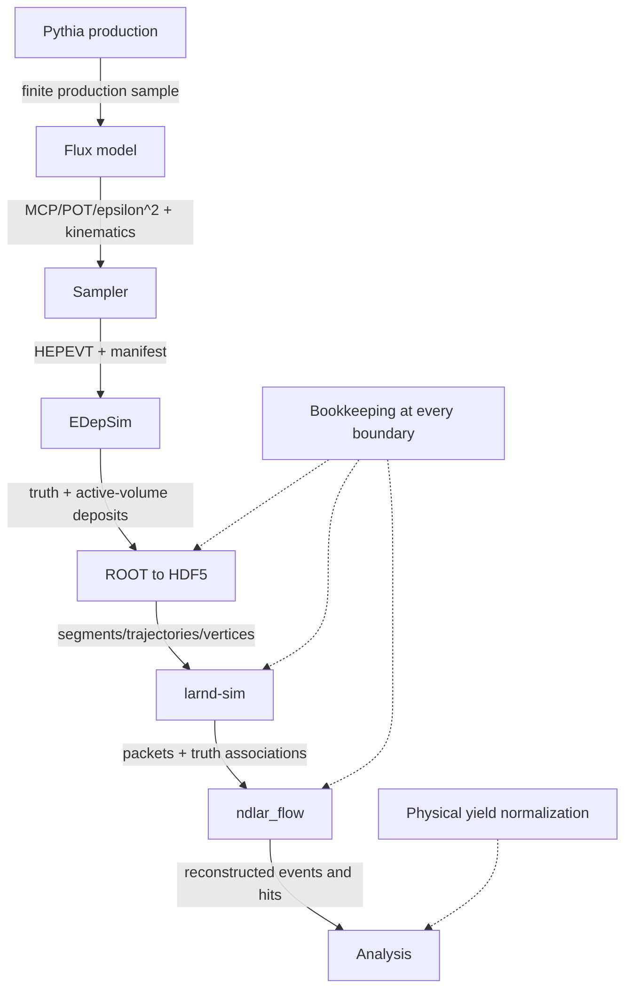
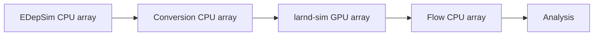

# Pipeline Architecture

## Separation of responsibilities

The project is designed so that no stage silently absorbs another stage's normalization or efficiency.



### Pythia production

Defines the parent-particle production sample, exotic-decay kinematics, summary counters, and raw spectra.

### Flux builder

Combines all open emitters with physical relative normalization and turns the finite Pythia sample into a reusable non-parametric model.

### Flux sampler

Draws detector-MC kinematics, performs the Pythia→2×2 rotation, applies the named beamline model, and writes HEPEVT plus machine-readable provenance.

### EDepSim

Defines local material transport and active-volume energy deposition with the custom MCP particle.

### Converter

Translates EDepSim ROOT truth and segments into the HDF5 schema expected by larnd-sim. It can remove events with no selected active-volume segment, so it is not the generated-event denominator.

### larnd-sim

Models quenching, drift, pixel response, thresholds, LArPix packets, truth associations, and—unless disabled—optical response.

### ndlar_flow

Builds charge events, raw/calibrated hits, timing information, and final reconstructed datasets.

## Independent stage products

Every stage should be resumable from its input file:

```text
*.hepevt + *.manifest.csv + *.summary.json
*.root
*.EDEPSIM.hdf5
*.LARNDINPUT.hdf5
*.LARNDSIM.hdf5
*.FLOW.hdf5
```

Do not organize production as one monolithic shell command. A Flow retry should not repeat larnd-sim, and a larnd-sim retry should not repeat EDepSim.

## Efficiency accounting

The correct denominator chain is:

```text
Pythia-normalized source or accepted flux
        ↓
generated detector-MC primaries
        ↓
active-LAr activity
        ↓
conversion survival
        ↓
charge packet production
        ↓
Flow event/hit reconstruction
        ↓
analysis selection
```

Each arrow can have an efficiency below one. The number of final Flow events is never a substitute for the number generated.

## Current accepted-stage shortcut

The present realistic model starts from a Pythia **accepted** spectrum. This is practical because it has high statistics, but it conditions the flux on the old Pythia `geometry_id=1` window.

It is appropriate for the current `straight_line_v0` detector study. It is not sufficient for a future beamline model that can scatter particles into or out of acceptance. That future work should begin from the pre-acceptance `source` stage.

## CPU/GPU deployment model

```text
Pythia/model/sampling   CPU
EDepSim                 CPU
ROOT→HDF5               CPU
larnd-sim               GPU
ndlar_flow              CPU (serial for the 100-event test)
analysis/display        CPU/interactive
```

Recommended future production:


