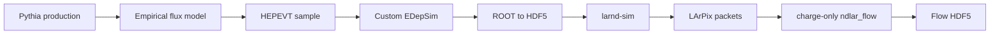

# MCP 2×2 Simulation Handbook

This handbook is the human-readable operating manual for the DUNE ND-LAr 2×2 millicharged-particle simulation project.

It documents the complete working path from a Pythia-derived MCP flux model to a charge-reconstructed `ndlar_flow` file on NERSC Perlmutter:

!!! success "Current milestone"
    A deterministic 100-event sample at `mχ=20.458 MeV`, transported with `q=0.3e`, has passed event-by-event Pythia→EDepSim validation, ROOT→HDF5 closure, four-module larnd-sim, and five-stage charge-only Flow reconstruction.

## How to use this handbook

- **Running the chain now:** begin with [Quick Start](quick-start.md), then follow the numbered pages under **Pipeline Manual**.
- **Understanding the physics and approximations:** read [Pipeline Architecture](architecture.md), [MCP Physics Model](physics-model.md), and [Pythia Flux Model](pythia-flux.md).
- **Checking whether a run is healthy:** use [Worked 100-event Reference](reference-sample.md) and [Validation Strategy](validation.md).
- **Recovering from a failure:** go to [Troubleshooting](troubleshooting.md).
- **Starting a new AI/code-agent session:** provide the repository-root [`PROJECT_CONTEXT.md`](https://github.com/BrunoGelli/2x2MCP-sim/blob/feature/pythia-spectrum-input/PROJECT_CONTEXT.md) as the canonical handoff.

## Two reference tracks

The project deliberately preserves two different reference samples.

### Controlled GPS baseline

The 2026-08-17 frozen sample uses a fixed monoenergetic transverse MCP gun. It is the stable regression test for particle physics, charge scaling, conversion, detector response, Flow, and event-display compatibility.

### Realistic Pythia sample

The 2026-08-19 worked example uses a physically normalized Pythia-derived accepted flux with realistic energy and angular variation. It is the first realistic generator sample validated through charge-only Flow.

!!! warning "Do not mix their expected numbers"
    The controlled gun and realistic sample have different mass, kinematics, event-selection behavior, segment populations, packet counts, and output sizes. Always identify which track a number belongs to.

## Current worked example at a glance

| Stage | Key result |
|---|---:|
| Generator | 100 events, seed 12345, `π0:98`, `η:2` |
| Flux normalization | `7.49514338415e-06 MCP/POT/ε²` |
| EDepSim | 100 events, manifest closure at floating-point precision |
| Active LAr | 97 events with activity; 96 with direct primary activity |
| Converted HDF5 | 97 vertices, 622 trajectories, 1331 segments |
| larnd-sim | 2142 packets, including 941 data packets |
| Charge-only Flow | 5/5 workflows complete; output opens successfully |

## Documentation philosophy

This is a version-controlled wiki, not an external GitHub Wiki. The Markdown lives beside the source, so a code tag or historical commit also preserves the matching manual.

The handbook distinguishes:

- **validated commands** — executed successfully in the worked sample;
- **recommended commands** — safer or more explicit forms of the validated commands;
- **historical context** — useful for understanding why a workaround exists;
- **unverified rebuild instructions** — clearly labeled where a fresh-account recreation is not yet proven.
